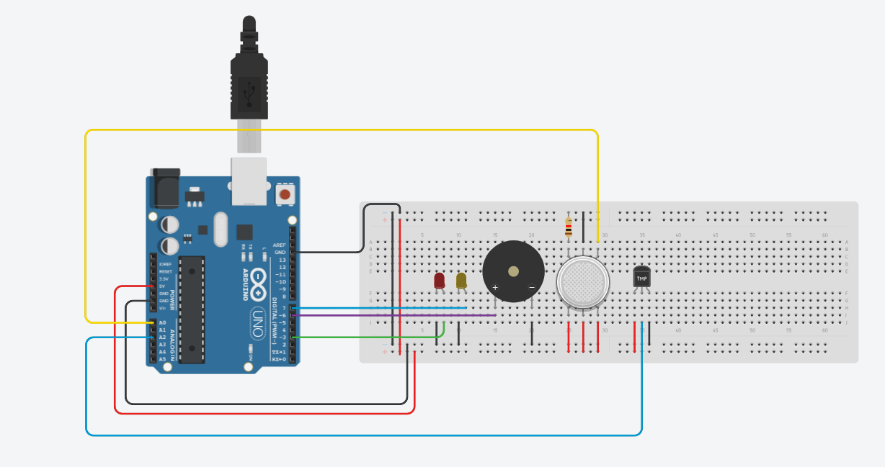
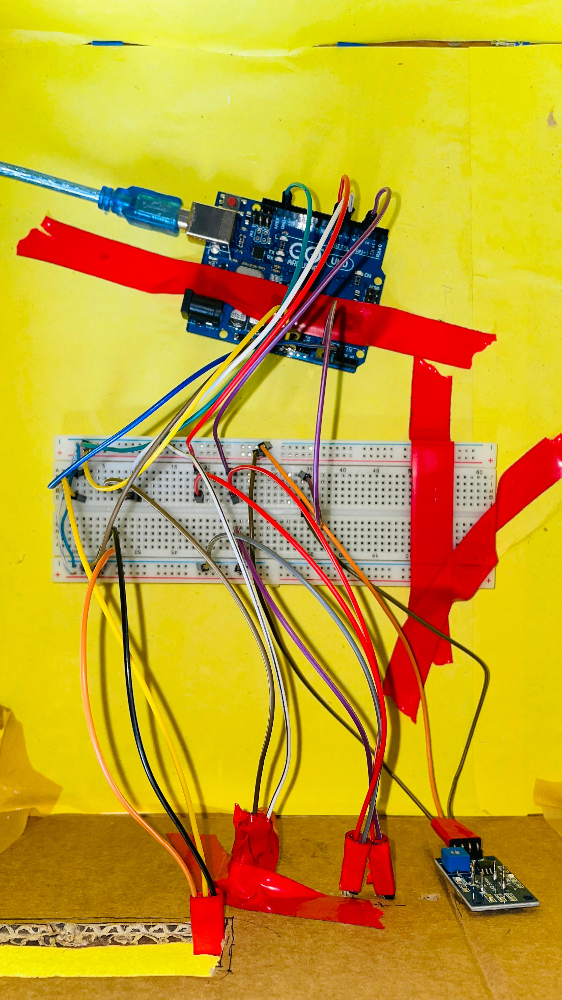

### Overview:

We develop a simple arduino based project that will aotumatically detect the gas and temperature when it cross the normal condition.

### Requirements:

The following tools are requried for project implementation:
<ul type='dot'>
    <li> Arduino uno v3</li>
    <li> BreadBoard </li>
    <li> LM 35 </li>
    <li> MQ-135 </li>
    <li> Jumper wires </li>
    <li> Buzzer </li>
    <li> LED </li>
</ul>

### Diagram:

### View:

